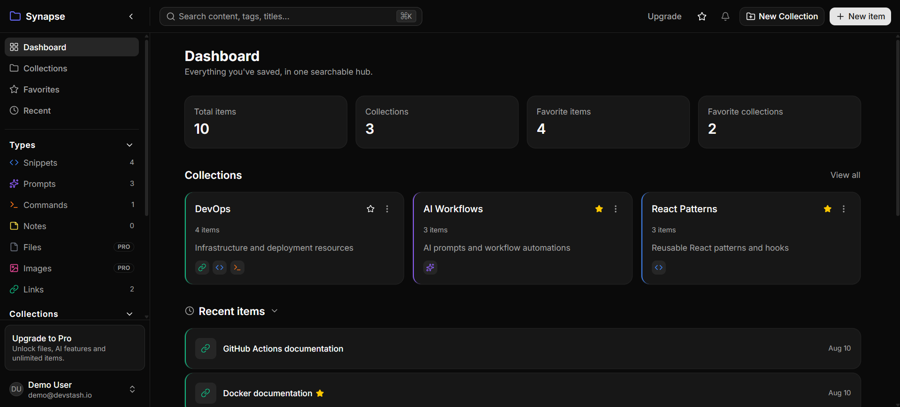

# Synapse

**A fast, searchable, AI-enhanced hub for everything a developer keeps scattered** — snippets, prompts, commands, notes, files and links, all in one place.

Snippets live in gists, prompts in chat history, commands in `.bash_history`, docs in a dozen tabs. Synapse pulls them into a single searchable hub with AI auto-tagging, summaries and full-text search.

🔗 **Live demo:** [synapse-gules-six.vercel.app](https://synapse-gules-six.vercel.app)
👤 **Demo account:** `demo@devstash.io` / `12345678`





## Features

- **Unified item types** — save Snippets, Prompts, Commands, Notes, Links, Files and Images as first-class item types, each with its own icon and colour. Users can also define custom types.
- **Collections** — group items of any type into collections; a single item can live in more than one collection at a time.
- **Instant search** — full-text search across content, titles, tags and types via a `⌘K` command palette.
- **Code editor** — Monaco-powered editing with syntax highlighting, driven by a per-item language field and saved editor preferences.
- **Markdown notes** — rendered with GitHub-Flavored Markdown.
- **Favorites & recents** — pin and favorite items and collections; a recent-activity view surfaces what you touched last.
- **AI features (Google Gemini)** — auto-tag suggestions, instant summaries and "Explain this code" on any snippet.
- **File & image uploads** — stored on Cloudflare R2 (S3-compatible), with per-item download endpoints.
- **Authentication** — email/password and GitHub OAuth, with email verification and password reset flows.
- **Billing** — Free and Pro tiers backed by Stripe subscriptions (monthly/yearly) and webhook-driven state, gating Pro-only features like file/image uploads and unlimited items.

## Tech stack

| Layer | Choices |
| --- | --- |
| **Framework** | Next.js 16 (App Router, Server Actions, Route Handlers), React 19, TypeScript |
| **Styling / UI** | Tailwind CSS v4, shadcn/ui, Base UI, lucide-react, `cmdk` command palette |
| **Database / ORM** | PostgreSQL (Neon), Prisma 7 with the `@prisma/adapter-pg` driver adapter |
| **Auth** | Auth.js (NextAuth v5), credentials + GitHub OAuth, bcrypt password hashing |
| **AI** | Google Gemini (`@google/genai`) for tagging, summaries and code explanation |
| **Payments** | Stripe subscriptions + webhooks |
| **File storage** | Cloudflare R2 via the AWS S3 SDK |
| **Email** | Resend (verification & password-reset emails) |
| **Rate limiting** | Upstash Redis (`@upstash/ratelimit`) on auth endpoints |
| **Validation** | Zod |
| **Testing** | Vitest |
| **Editor** | Monaco (`@monaco-editor/react`) |
| **Deployment** | Vercel |

## Data model

The schema is centred on a flexible `Item` that can hold text/markdown, a file or a URL, distinguished by a `ContentType` enum (`TEXT` / `FILE` / `URL`):

- **Item** — the core unit of content. Carries title, description, content/url/file metadata, language, favorite/pinned flags, and belongs to one `ItemType`.
- **ItemType** — system types (Snippet, Prompt, Command, Note, Link, File, Image) plus user-defined custom types, each with a lucide icon and a hex colour.
- **Collection** — a named group of items; can define a default type for new items.
- **ItemCollection** — join table enabling the many-to-many between items and collections.
- **Tag** — user-scoped tags in an implicit many-to-many with items.
- **User / Account / Session / VerificationToken** — Auth.js models, extended on `User` with Stripe subscription fields and editor preferences.

## Getting started

### Prerequisites

- Node.js 20+
- A PostgreSQL database (the project is set up for [Neon](https://neon.tech), but any Postgres works)

### 1. Clone and install

```bash
git clone https://github.com/solomiasyhlova/synapse.git
cd synapse
npm install
```

`postinstall` runs `prisma generate` automatically.

### 2. Configure environment

Copy the example file and fill in the values you need:

```bash
cp .env.example .env
```

At minimum, `DATABASE_URL` and `AUTH_SECRET` are required to run locally. Generate a secret with:

```bash
npx auth secret
```

The AI, billing, upload, email and rate-limiting integrations are optional — features that depend on unset keys degrade gracefully (e.g. rate limiting fails open, email verification can be disabled).

### 3. Set up the database

```bash
npm run db:migrate   # apply migrations
npm run db:seed      # seed system item types + the demo user
```

### 4. Run the dev server

```bash
npm run dev
```

Open [http://localhost:3000](http://localhost:3000). Sign in with the seeded demo account (`demo@devstash.io` / `12345678`) or register a new one.

## Environment variables

| Variable | Purpose |
| --- | --- |
| `DATABASE_URL` | PostgreSQL connection string (Neon) |
| `AUTH_SECRET` | Auth.js session secret |
| `AUTH_GITHUB_ID`, `AUTH_GITHUB_SECRET` | GitHub OAuth app credentials |
| `RESEND_API_KEY`, `EMAIL_FROM` | Resend, for verification & reset emails |
| `EMAIL_VERIFICATION_ENABLED` | Set to `false` to skip email verification |
| `NEXT_PUBLIC_APP_URL` | Base URL used to build absolute links in emails |
| `UPSTASH_REDIS_REST_URL`, `UPSTASH_REDIS_REST_TOKEN` | Upstash Redis for auth rate limiting |
| `R2_ACCOUNT_ID`, `R2_ACCESS_KEY_ID`, `R2_SECRET_ACCESS_KEY`, `R2_BUCKET_NAME`, `R2_PUBLIC_URL` | Cloudflare R2 file storage |
| `STRIPE_SECRET_KEY`, `STRIPE_PUBLISHABLE_KEY`, `STRIPE_WEBHOOK_SECRET`, `STRIPE_PRICE_ID_MONTHLY`, `STRIPE_PRICE_ID_YEARLY` | Stripe billing |
| `GEMINI_API_KEY` | Google Gemini API for AI features |

## Scripts

| Command | Description |
| --- | --- |
| `npm run dev` | Start the development server |
| `npm run build` | Production build |
| `npm run start` | Start the production server |
| `npm run lint` | Run ESLint |
| `npm test` | Run the Vitest suite |
| `npm run test:watch` | Vitest in watch mode |
| `npm run db:migrate` | Create/apply a dev migration |
| `npm run db:deploy` | Apply migrations in production |
| `npm run db:studio` | Open Prisma Studio |
| `npm run db:seed` | Seed system types and the demo user |

## Project structure

```
src/
├── app/
│   ├── (app)/            # Authenticated app: dashboard, collections, items,
│   │                     # favorites, recent, settings, upgrade
│   ├── api/              # Route handlers: auth, items, upload, ai, stripe webhook
│   ├── sign-in/ register/ forgot-password/ reset-password/ verify-email/
│   └── billing/ profile/
├── actions/              # Server Actions
├── components/           # UI, dashboard, auth, billing, homepage, settings
├── lib/                  # ai, auth, db, email, validations
├── types/
└── generated/prisma/     # Generated Prisma client
prisma/                   # Schema, migrations, seed
```

## Deployment

The app is deployed on **Vercel** with a Neon Postgres database. For production, set every required environment variable in the Vercel project, point `DATABASE_URL` at the production branch, run `npm run db:deploy` for migrations, and configure the Stripe webhook to hit `/api/webhooks/stripe`.

## License

This project was built for learning and portfolio purposes.
