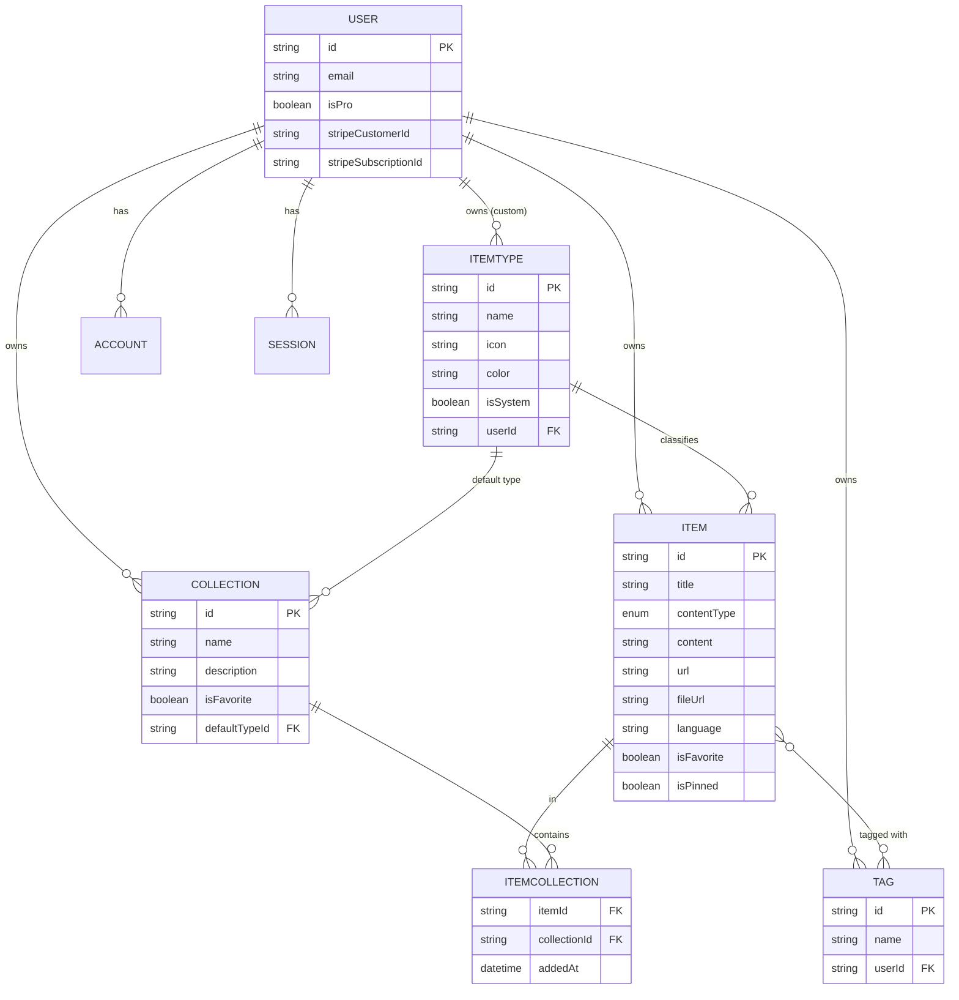
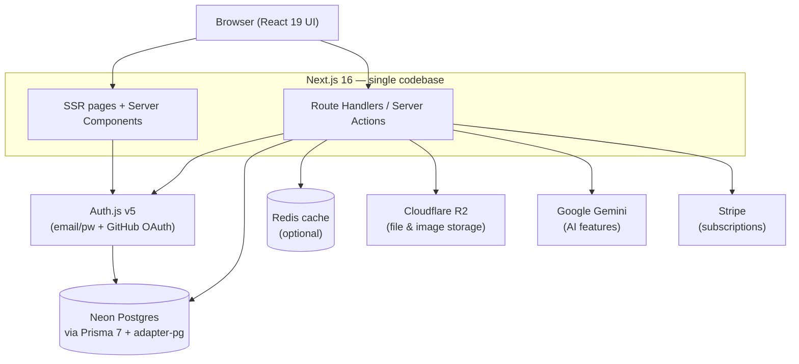

# Synapse — Project Overview

> **One fast, searchable, AI-enhanced hub for everything a developer keeps scattered:** snippets, prompts, notes, commands, links, and files.

**Stack at a glance:** Next.js 16 · React 19 · TypeScript · Prisma 7 + Neon Postgres · Auth.js v5 · Cloudflare R2 · Google Gemini · Tailwind v4 + shadcn/ui · Stripe

---

## 1. Problem

Developers scatter their essentials across too many tools:

| What | Where it usually lives |
|------|------------------------|
| Code snippets | VS Code, Notion |
| AI prompts | Chat histories |
| Context files | Buried in projects |
| Useful links | Browser bookmarks |
| Docs | Random folders |
| Commands | `.txt` files |
| Project templates | GitHub Gists |
| Terminal commands | Bash history |

The result is constant context switching, lost knowledge, and inconsistent workflows. **Synapse consolidates all of it into a single, fast, searchable, AI-enhanced hub.**

---

## 2. Target Users

- **Everyday Developer** — needs a fast way to grab snippets, prompts, commands, and links.
- **AI-first Developer** — saves prompts, contexts, workflows, and system messages.
- **Content Creator / Educator** — stores code blocks, explanations, and course notes.
- **Full-stack Builder** — collects patterns, boilerplates, and API examples.

---

## 3. Features

### A. Items & Item Types

Every piece of saved knowledge is an **Item**. Each item has a **type**. Users can create custom types later, but the following **system types** ship first and cannot be edited or deleted:

| Type | Content kind | Availability |
|------|--------------|--------------|
| Snippet | text | Free |
| Prompt | text | Free |
| Note | text (markdown) | Free |
| Command | text | Free |
| Link | url | Free |
| File | file | **Pro** |
| Image | file | **Pro** |

A type resolves to one of three **content kinds**:
- **text** — snippet, prompt, note, command (stored as markdown)
- **url** — link
- **file** — file, image (uploaded to Cloudflare R2)

Items are quick to create and open in a **drawer** for fast access.

### B. Collections

Users create **collections** that can hold items of any type. An item can belong to **multiple collections** simultaneously — e.g. a React snippet living in both *React Patterns* and *Interview Prep*.

Examples:
- **React Patterns** — snippets, notes
- **Context Files** — files
- **Python Snippets** — snippets

### C. Search

Powerful search across **content, tags, titles, and types**.

### D. Authentication

Email/password **or** GitHub sign-in (Auth.js v5).

### E. Other Features

- Favorite collections and items
- Pin items to the top
- Recently used
- Import code from a file
- Markdown editor for text types
- File upload for file types (file / image)
- Export data in multiple formats
- Dark mode (default for devs)
- Add/remove items to/from multiple collections
- View which collections an item belongs to

### F. AI Features — *Pro only*

Powered by **Google Gemini** (`gemini-2.5-flash-lite` / `gemini-2.5-flash`):

- AI auto-tag suggestions
- AI summaries
- "Explain this code"
- Prompt optimizer

---

## 4. Data Model

### Entity relationships



### Prisma schema

> **Prisma 7 notes** (verified against the 7.x release line): the query engine is now Rust-free (pure TypeScript), a **`prisma.config.ts` file is required** for migrations/introspection, **driver adapters are mandatory** (use `@prisma/adapter-pg` for Neon), and generated client code now lives **in your repo** (e.g. `src/generated/prisma`) rather than in `node_modules`. Fetch the latest [upgrade guide](https://www.prisma.io/docs/orm/more/upgrade-guides/upgrading-versions/upgrading-to-prisma-7) before scaffolding.

```prisma
// prisma/schema.prisma

generator client {
  provider = "prisma-client"          // Prisma 7 generator
  output   = "../src/generated/prisma" // generated into the repo, not node_modules
}

datasource db {
  provider = "postgresql"
  url      = env("DATABASE_URL")
}

// ─────────────────────────── Auth (Auth.js v5 / Prisma adapter) ───────────────────────────

model User {
  id            String    @id @default(cuid())
  name          String?
  email         String    @unique
  emailVerified DateTime?
  image         String?
  passwordHash  String?   // email/password credentials

  // Billing
  isPro                Boolean @default(false)
  stripeCustomerId     String? @unique
  stripeSubscriptionId String? @unique

  // Relations
  accounts    Account[]
  sessions    Session[]
  items       Item[]
  collections Collection[]
  tags        Tag[]
  itemTypes   ItemType[]   // custom types only; system types have userId = null

  createdAt DateTime @default(now())
  updatedAt DateTime @updatedAt
}

model Account {
  id                String  @id @default(cuid())
  userId            String
  type              String
  provider          String
  providerAccountId String
  refresh_token     String?
  access_token      String?
  expires_at        Int?
  token_type        String?
  scope             String?
  id_token          String?
  session_state     String?

  user User @relation(fields: [userId], references: [id], onDelete: Cascade)

  @@unique([provider, providerAccountId])
}

model Session {
  id           String   @id @default(cuid())
  sessionToken String   @unique
  userId       String
  expires      DateTime
  user         User     @relation(fields: [userId], references: [id], onDelete: Cascade)
}

model VerificationToken {
  identifier String
  token      String
  expires    DateTime

  @@unique([identifier, token])
}

// ─────────────────────────── Core domain ───────────────────────────

enum ContentType {
  TEXT
  FILE
  URL
}

model Item {
  id          String      @id @default(cuid())
  title       String
  description String?
  contentType ContentType @default(TEXT)

  content  String? // text/markdown — null for file/url items
  url      String? // link items — null otherwise
  fileUrl  String? // Cloudflare R2 URL — null for text/url items
  fileName String? // original filename
  fileSize Int?    // bytes
  language String? // optional, drives syntax highlighting

  isFavorite Boolean @default(false)
  isPinned   Boolean @default(false)

  // Relations
  userId      String
  user        User             @relation(fields: [userId], references: [id], onDelete: Cascade)
  itemTypeId  String
  itemType    ItemType         @relation(fields: [itemTypeId], references: [id])
  tags        Tag[]            // implicit many-to-many
  collections ItemCollection[]

  createdAt DateTime @default(now())
  updatedAt DateTime @updatedAt

  @@index([userId])
  @@index([itemTypeId])
}

model ItemType {
  id       String  @id @default(cuid())
  name     String
  icon     String  // lucide icon name
  color    String  // hex, e.g. "#3b82f6"
  isSystem Boolean @default(false)

  // Relations
  userId                String?      // null for system types
  user                  User?        @relation(fields: [userId], references: [id], onDelete: Cascade)
  items                 Item[]
  defaultForCollections Collection[] @relation("CollectionDefaultType")

  @@unique([userId, name])
}

model Collection {
  id          String  @id @default(cuid())
  name        String
  description String?
  isFavorite  Boolean @default(false)

  // Default type for a fresh, empty collection
  defaultTypeId String?
  defaultType   ItemType? @relation("CollectionDefaultType", fields: [defaultTypeId], references: [id])

  // Relations
  userId String
  user   User             @relation(fields: [userId], references: [id], onDelete: Cascade)
  items  ItemCollection[]

  createdAt DateTime @default(now())
  updatedAt DateTime @updatedAt

  @@index([userId])
}

// Join table: item <-> collection (tracks when an item joined a collection)
model ItemCollection {
  itemId       String
  collectionId String
  addedAt      DateTime @default(now())

  item       Item       @relation(fields: [itemId], references: [id], onDelete: Cascade)
  collection Collection @relation(fields: [collectionId], references: [id], onDelete: Cascade)

  @@id([itemId, collectionId])
  @@index([collectionId])
}

model Tag {
  id     String @id @default(cuid())
  name   String
  userId String
  user   User   @relation(fields: [userId], references: [id], onDelete: Cascade)
  items  Item[] // implicit many-to-many

  @@unique([userId, name])
}
```

---

## 5. Architecture



- **One repo / one codebase** to minimize overhead.
- SSR pages with dynamic client components.
- Route handlers / server actions cover items, file uploads, and AI calls.

---

## 6. Type Reference — Colors & Icons

Icons are [lucide-react](https://lucide.dev/) names.

| Type | Icon (lucide) | Color | Swatch |
|------|---------------|-------|--------|
| Snippet | `Code` | `#3b82f6` (blue) | 🔵 |
| Prompt | `Sparkles` | `#8b5cf6` (purple) | 🟣 |
| Command | `Terminal` | `#f97316` (orange) | 🟠 |
| Note | `StickyNote` | `#fde047` (yellow) | 🟡 |
| File | `File` | `#6b7280` (gray) | ⚪ |
| Image | `Image` | `#ec4899` (pink) | 🩷 |
| Link | `Link` | `#10b981` (emerald) | 🟢 |

```ts
// Suggested seed constant for system types
export const SYSTEM_TYPES = [
  { name: "snippet", icon: "Code",       color: "#3b82f6", contentKind: "TEXT" },
  { name: "prompt",  icon: "Sparkles",   color: "#8b5cf6", contentKind: "TEXT" },
  { name: "command", icon: "Terminal",   color: "#f97316", contentKind: "TEXT" },
  { name: "note",    icon: "StickyNote", color: "#fde047", contentKind: "TEXT" },
  { name: "link",    icon: "Link",       color: "#10b981", contentKind: "URL"  },
  { name: "file",    icon: "File",       color: "#6b7280", contentKind: "FILE", pro: true },
  { name: "image",   icon: "Image",      color: "#ec4899", contentKind: "FILE", pro: true },
] as const;
```

---

## 7. Routing Map

Items are addressed by type, e.g. `/items/snippets`.

| Route | Purpose |
|-------|---------|
| `/` | Dashboard — grid of collection cards + recent items |
| `/items/[type]` | All items of a type (e.g. `/items/snippets`) |
| `/items/[type]/[id]` | Direct link to a single item (also opens in drawer) |
| `/collections` | All collections |
| `/collections/[id]` | Items within a collection |
| `/search` | Search results |
| `/settings` | Account, theme, export |
| `/billing` | Plan + Stripe management |
| `/api/*` | Route handlers (items, uploads, AI, webhooks) |

---

## 8. Tech Stack

### Framework
- **[Next.js 16](https://nextjs.org/blog/next-16)** / **[React 19](https://react.dev/)** — App Router, Server Components by default, Turbopack, React 19.2 features. SSR pages with dynamic components; route handlers for backend needs (items, file uploads, AI calls).
- **TypeScript** throughout for type safety.
- ⚠️ Next.js 16 removed the Pages Router entirely and ships regular security releases — pin versions and stay on the current patched LTS.

### Database & ORM
- **[Neon](https://neon.tech/docs)** — serverless PostgreSQL in the cloud.
- **[Prisma 7](https://www.prisma.io/blog/announcing-prisma-orm-7-0-0)** — ORM for DB connection and interaction. Requires `prisma.config.ts` and a driver adapter (`@prisma/adapter-pg`). Always [fetch the latest docs](https://www.prisma.io/docs) as 7.x is evolving quickly.
- **[Redis](https://redis.io/docs/)** — caching *(optional / maybe)*.

> 🚫 **Migration rule (non-negotiable):** **NEVER** use `prisma db push` or edit the DB structure directly. Every schema change goes through a **migration**, run in **dev first, then prod**.

### File Storage
- **[Cloudflare R2](https://developers.cloudflare.com/r2/)** — file & image uploads (S3-compatible, no egress fees).

### Authentication
- **[Auth.js v5 (NextAuth)](https://authjs.dev/)** — email/password + GitHub OAuth, backed by the Prisma adapter.

### AI
- **[Google Gemini](https://ai.google.dev/)** — `gemini-2.5-flash-lite` / `gemini-2.5-flash`.

### Styling
- **[Tailwind CSS v4](https://tailwindcss.com/blog/tailwindcss-v4)** + **[shadcn/ui](https://ui.shadcn.com/)**.

### Payments
- **[Stripe](https://stripe.com/docs)** — freemium subscriptions.

---

## 9. Monetization (Freemium)

> **During development, feature-flag everything so all users can access everything.** Build the Pro plumbing (Stripe fields, gates) now, enforce limits later.

| | **Free** | **Pro — $8/mo or $72/yr** |
|---|---|---|
| Items | 50 total | Unlimited |
| Collections | 3 | Unlimited |
| System types | All except file/image | All |
| File & image uploads | ❌ | ✅ |
| Custom types | ❌ | ✅ *(later)* |
| Search | Basic | Full |
| AI auto-tagging | ❌ | ✅ |
| AI code explanation | ❌ | ✅ |
| AI prompt optimizer | ❌ | ✅ |
| Export (JSON / ZIP) | ❌ | ✅ |
| Support | Standard | Priority |

---

## 10. UI / UX

### General
- Modern, minimal, developer-focused.
- **Dark mode by default**, light mode optional.
- Clean typography, generous whitespace, subtle borders and shadows.
- Syntax highlighting for code blocks.
- **References:** Notion, Linear, Raycast.

### Design References

### Screenshots

Refer to the screenshots below as a base for dashboard UI, it doesn't have to be exact. Use it as reference: @context\screenshots\dashboard-ui-main.png 
@context\screenshots\dashboard-ui-drawer.png

### Layout
- **Sidebar + main content**, collapsible sidebar.
  - **Sidebar:** item types (Snippets, Commands, …) linking to their item lists, plus latest collections.
  - **Main:** grid of collection cards, **background-colored** by the type they hold most of. Items render underneath as cards **border-colored** by their type.
- Individual items open in a **quick-access drawer**.

### Responsive
- Desktop-first, mobile usable. Sidebar collapses into a drawer on mobile.

### Micro-interactions
- Smooth transitions
- Hover states on cards
- Toast notifications for actions
- Loading skeletons

---

## 11. Reviewer Notes & Open Questions

Cleanups and design calls made while formatting this — all fair game to change:

1. **`ContentType` now has three values (`TEXT` / `FILE` / `URL`).** Your data mockup listed `contentType` as `text | file`, but Feature A defines three content kinds (text, url, file) and link items need somewhere to live. Modeled as a 3-value enum with a dedicated `url` field. *Confirm this is what you want.*
2. **Tags are now scoped to a user (`userId` + `@@unique([userId, name])`).** The original `TAG` had only `id` and `name`, which would make tags global across all accounts (name collisions, privacy leaks). Scoped per-user instead. *Flag if tags were meant to be shared/global.*
3. **Added the standard Auth.js Prisma models** (`Account`, `Session`, `VerificationToken`) since GitHub OAuth needs `Account`. Email/password uses `passwordHash` on `User`. If you go JWT-session-only, `Session` can be dropped.
4. **`defaultTypeId` → real relation.** Wired `Collection.defaultTypeId` to `ItemType` via a named relation (`CollectionDefaultType`).
5. **Cascade deletes** added on user-owned relations so deleting a user/item cleans up cleanly. Double-check the `Item ⇄ ItemType` direction — types are currently *not* cascade-deleted when referenced (system types must survive).
6. **Fixed typos** from the draft: "GitHu gists" → GitHub Gists; stray hyphens in field comments.
7. **Free-tier "basic search" scope** — worth defining precisely (e.g. title + type only, no full content/tag search) before build.
8. **Pin/favorite limits?** No cap defined for pinned or favorited items — decide whether Free users have one.

---

*Last updated: July 25, 2026*
